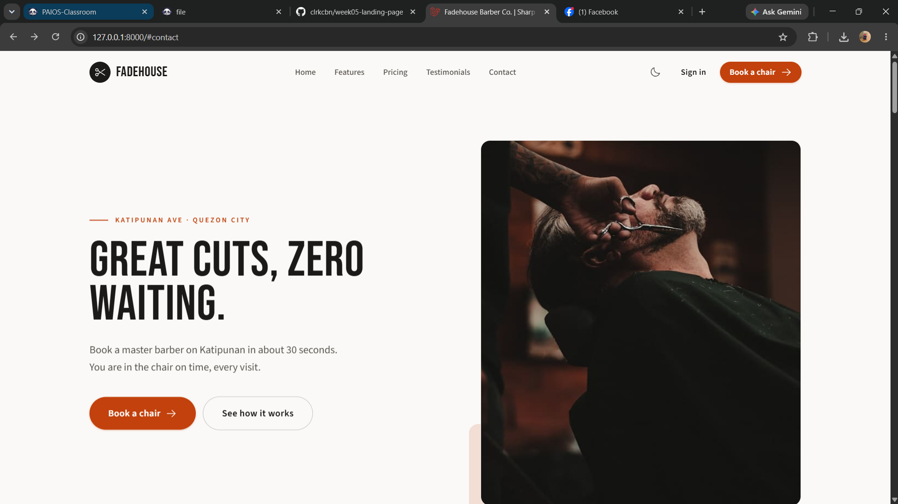
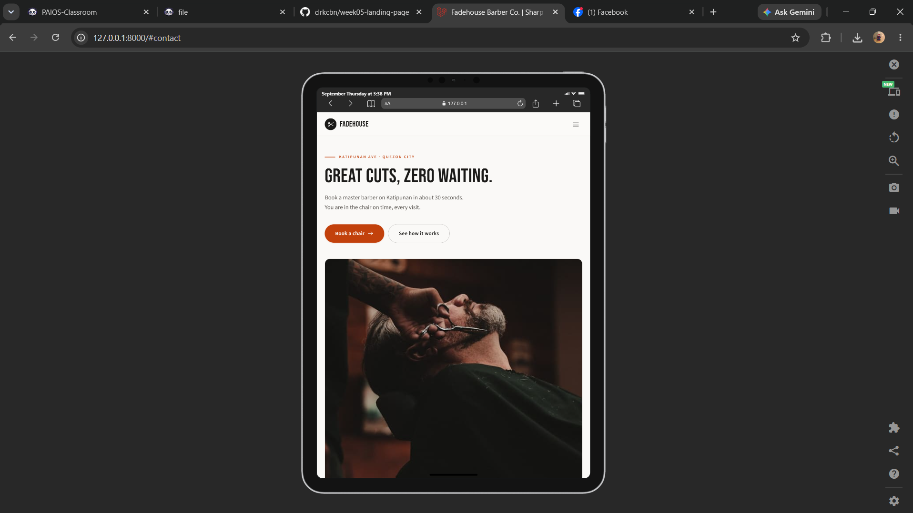
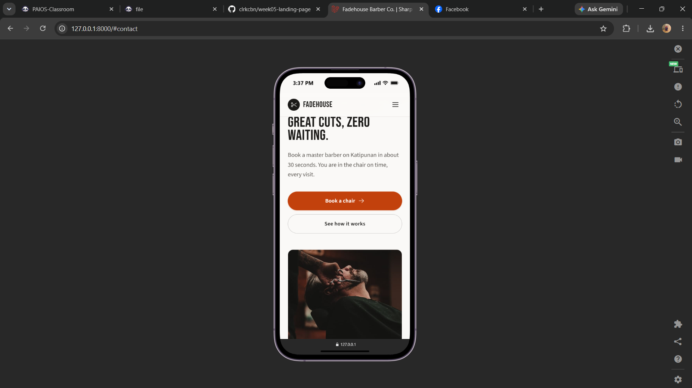

# Fadehouse Barber Co. — Responsive Product Landing Page

> ITST 302 – Client-Server Technologies · Week 5 · Mini Project 04
> Responsive Product Landing Page built with **Laravel 13**, **Blade Components**, and **Tailwind CSS v4**.

A modern, mobile-first landing page for a real-style neighbourhood business: **Fadehouse Barber Co.**,
a grooming studio on Katipunan Ave, Quezon City. The page turns the shop's information (services,
membership packages, hours, location, reviews) into a clean, responsive, component-driven website.

**Live preview:** run locally with `composer install && npm install && npm run build && php artisan serve`
(full steps below).

---

## Table of contents

1. [Project title](#1-project-title)
2. [Introduction](#2-introduction)
3. [Objectives](#3-objectives)
4. [Responsive web design](#4-responsive-web-design)
5. [Tailwind CSS](#5-tailwind-css)
6. [Blade components](#6-blade-components)
7. [User interface design](#7-user-interface-design)
8. [Folder structure](#8-folder-structure)
9. [Screenshots](#9-screenshots)
10. [Before and after](#10-before-and-after)
11. [Problems and solutions](#11-problems-and-solutions)
12. [Reflection](#12-reflection)
13. [Getting started](#13-getting-started)
14. [Credits](#14-credits)

---

## 1. Project title

**Fadehouse Barber Co. — Responsive Product Landing Page**

Repository: `week05-landing-page` · Type: individual mini project · Points: 100

---

## 2. Introduction

### What is a product landing page?

A **landing page** is a single, focused web page whose only job is to make a good first impression
and move one specific action forward. Unlike a multi-page website, it has no deep navigation and no
distractions: a visitor arrives, understands the offer in a few seconds, and is guided toward one
primary call-to-action (here, *"Book a chair"*).

### Why landing pages matter for businesses

- **First impression.** For most customers the landing page *is* the business online. A slow,
  cluttered, or non-responsive page costs trust before a word is read.
- **Conversion.** Every section is arranged to answer the next question a customer has (What is this?
  Why should I care? How much? Do others trust it? How do I start?) and remove friction from booking.
- **Reach.** Over half of web traffic is on phones. A page that only works on desktop is invisible to
  most of the people a small shop wants to reach.
- **Cost.** One well-built page is cheaper to run and easier to keep current than a large site, which
  is exactly what a barbershop, café, or salon needs.

### Purpose of this project

To practise **component-based frontend development in Laravel**: building a real, responsive interface
out of small reusable Blade components styled entirely with Tailwind utility classes, organised the
way a production Laravel app would be, and documented so another developer can understand the
architecture quickly.

---

## 3. Objectives

Accomplished during this activity:

- [x] Develop responsive web interfaces using **Tailwind CSS** (mobile-first, `sm` / `md` / `lg` / `xl` breakpoints).
- [x] Create **reusable Blade components** so no section markup is copy-pasted (12 components, each used 1 to 6 times, plus one shared layout).
- [x] Apply responsive design for **desktop, laptop, tablet, and mobile** using Flexbox and CSS Grid.
- [x] Organise the frontend following **Laravel conventions**: `layouts/`, `components/`, `pages/`, one main layout every page extends.
- [x] Implement a **consistent design system**: one type scale, one spacing rhythm, one accent colour, one radius system.
- [x] Add real **interaction states**: hover, focus-visible, active, loading, inline form validation, empty/success states.
- [x] Support **light and dark mode** with a pre-paint theme boot script and a persisted toggle.
- [x] Respect **accessibility and motion preferences** (`prefers-reduced-motion`, skip link, ARIA, 4.5:1 contrast).
- [x] Document the frontend architecture and publish the project on **GitHub** with a meaningful commit history.

---

## 4. Responsive web design

### Mobile-first design

Every component is written for the smallest screen first; larger layouts are opt-in via breakpoint
prefixes. For example the features grid starts as one column and *adds* columns as space allows:

```blade
<div class="grid gap-5 sm:grid-cols-2 lg:grid-cols-3">
```

Base styles (no prefix) target mobile. `sm:` (≥640px) introduces two columns, `lg:` (≥1024px)
introduces three. Nothing is written "desktop-down".

### Responsive breakpoints

Tailwind's default, systematic breakpoints are used throughout:

| Prefix | Min width | Used for |
|--------|-----------|----------|
| (none) | 0         | Phone — single column, stacked, full-width controls |
| `sm`   | 640px     | Large phone / small tablet — 2-column grids, side-by-side buttons |
| `md`   | 768px     | Tablet — testimonials go 3-up, form fields pair up |
| `lg`   | 1024px    | Laptop / desktop — full nav bar appears, hero splits 50/50, 3-column pricing |
| `xl`   | 1280px    | Large desktop — wider gutters via `lg:px-8` and `max-w-7xl` container |

The navigation switches from a hamburger drawer to a full horizontal bar at `lg`. The hero image sits
*below* the copy on mobile and *beside* it (`lg:grid-cols-[1.05fr_0.95fr]`) on desktop.

### Flexbox

Used for one-dimensional alignment: the nav bar (`flex items-center justify-between`), button internals
(icon + label), the billing switch row, stat items, and footer link rows. Example from the hero CTAs:

```blade
<div class="flex flex-col gap-3 sm:flex-row sm:items-center">
```

Stacked and full-width on mobile, inline on `sm` and up.

### CSS Grid

Used for two-dimensional layout: the features grid, the 12-column product-showcase grid
(`lg:grid-cols-12` with `col-span-8` / `col-span-4` children), the pricing grid, the testimonials grid,
and the footer. Grid is preferred over flexbox percentage math so columns reflow cleanly with a single
`grid-cols-*` change per breakpoint.

### User experience (UX)

- **No horizontal scroll** at any width; the body never scrolls sideways.
- **Touch targets** are at least 44px tall (buttons use `py-3`/`py-4`, nav items `py-3`).
- **`min-h-dvh`** instead of `h-screen` so the hero doesn't jump when the mobile browser bar hides.
- **Reserved space** for images via aspect-ratio wrappers and explicit `width`/`height` to keep layout
  shift (CLS) near zero.
- **Reduced motion** — every scroll-reveal and transition collapses to static under
  `prefers-reduced-motion: reduce`.
- **Keyboard** — visible `:focus-visible` rings everywhere, a "Skip to content" link, `Esc` closes the
  mobile menu.

### Why responsive design matters

Users arrive from phones, tablets, laptops, and desktops, often on slow connections. A responsive
layout means one codebase serves all of them well, Google ranks the page higher, and the business
doesn't lose the majority of its audience to a broken mobile view. For a local shop, the phone
experience *is* the product.

---

## 5. Tailwind CSS

### Utility-first CSS

Instead of writing custom CSS classes and switching between files, styling is composed from small
single-purpose utilities directly in the markup (`flex`, `gap-6`, `rounded-2xl`, `text-muted`,
`hover:-translate-y-1`). The style of a component is visible where the component is defined.

### Advantages seen in this project

- **No dead CSS.** Tailwind only ships the classes actually used — the built stylesheet is ~41 KB
  (7.9 KB gzipped) for the entire page.
- **Consistency by constraint.** Spacing, colour, and type come from a fixed scale, so it is hard to
  introduce a one-off `13px` margin or an off-brand colour.
- **Fast iteration.** Layout changes are one class, not a round trip through a separate stylesheet.
- **Design tokens in one place.** Tailwind v4's CSS-first `@theme` block holds every colour and font,
  and dark mode overrides them with plain CSS custom properties.

### Responsive utility classes

Any utility can be prefixed with a breakpoint. Real examples from the code:

```blade
{{-- Navbar: hidden on mobile, flex row on large screens --}}
<ul class="hidden items-center gap-8 lg:flex">

{{-- Hero heading: scales up in three steps --}}
<h1 class="font-display text-[2.75rem] sm:text-6xl lg:text-[5.25rem]">

{{-- Pricing: single column, then three across on desktop --}}
<div class="grid gap-6 lg:grid-cols-3">
```

### Component styling

Design decisions live in the Blade component, driven by props. The `Button` component maps a
`variant` prop to a utility string so every button on the page is styled from one source of truth:

```blade
$variants = [
    'primary' => 'bg-accent text-on-accent hover:bg-accent-strong shadow-sm shadow-accent/25',
    'outline' => 'border border-ink/25 text-ink hover:border-ink hover:bg-ink/[0.04]',
    'ghost'   => 'text-ink hover:bg-ink/[0.06]',
    'light'   => 'bg-on-inverse text-inverse hover:bg-white',
];
```

Custom design tokens are declared once in `resources/css/app.css`:

```css
@theme {
    --font-display: 'Bebas Neue', ui-sans-serif, system-ui, sans-serif;
    --font-sans: 'Source Sans 3', ui-sans-serif, system-ui, sans-serif;
    --color-accent: #c2410c;      /* rust — the single accent colour */
    --color-ink: #1b1a18;         /* warm near-black text */
    --color-muted: #57534e;       /* secondary text, 4.5:1 on the background */
    /* …full palette in the file… */
}
```

Tailwind then generates `bg-accent`, `text-ink`, `text-muted`, `font-display`, etc. automatically.

---

## 6. Blade components

### What are Blade components?

Blade components are reusable pieces of UI stored in `resources/views/components/`. A file named
`button.blade.php` is used as `<x-button>`. Data passed as attributes (`<x-button variant="primary">`)
is received with `@props`. Components can accept slots (`{{ $slot }}`) for their inner content.

### Why reusable components improve maintainability

- **One definition, many uses.** The pricing section renders three cards from one `<x-pricing-card>`.
  Fixing a padding bug or a contrast issue is a one-file change that updates every instance.
- **No duplicated markup.** Without components, the six feature cards would be ~120 lines of repeated
  HTML. With `<x-feature-card>` the page loops over a data array.
- **Readable pages.** `pages/home.blade.php` reads like an outline of the page
  (`<x-navbar />`, `<x-hero />`, `<x-showcase />`, …) instead of a wall of divs.
- **Safer changes.** Props document what a component needs. A typo in a prop name fails loudly instead
  of silently rendering wrong.

### Components in this project

| Component | `<x-…>` | Purpose | Key props |
|-----------|---------|---------|-----------|
| `layouts/app.blade.php` | `@extends` | HTML skeleton, `<head>`, theme boot script, Vite assets, skip link | `@yield('content')` |
| `button.blade.php` | `<x-button>` | Every button and CTA link (`<a>` or `<button>`) | `variant`, `size`, `href`, `type`, `icon` |
| `icon.blade.php` | `<x-icon>` | Inline SVG from one Phosphor icon set | `name`, `label` |
| `navbar.blade.php` | `<x-navbar>` | Sticky nav, desktop links, mobile drawer, theme toggle | — |
| `hero.blade.php` | `<x-hero>` | Headline, sub-copy, two CTAs, image, trust strip | `eyebrow`, `title`, `description`, `image` |
| `section-heading.blade.php` | `<x-section-heading>` | Consistent eyebrow + `<h2>` + intro for each section | `eyebrow`, `title`, `intro`, `align`, `tone` |
| `feature-card.blade.php` | `<x-feature-card>` | One feature: icon chip, title, description | `icon`, `title`, `description`, `tone` |
| `showcase.blade.php` | `<x-showcase>` | Product showcase: wide shot, phone mock-up, detail shot, highlights | image props |
| `pricing-card.blade.php` | `<x-pricing-card>` | One membership plan with live monthly/annual price | `name`, `priceMonthly`, `blurb`, `features`, `featured`, `cta` |
| `testimonial-card.blade.php` | `<x-testimonial-card>` | Rating, quote, customer photo/name/role | `quote`, `name`, `position`, `photo`, `rating` |
| `contact.blade.php` | `<x-contact>` | Booking form with inline validation + shop info | — |
| `cta.blade.php` | `<x-cta>` | Full-width closing call-to-action band | `phone`, `phoneHref` |
| `footer.blade.php` | `<x-footer>` | Company info, quick links, socials, contact, copyright | — |

### Sample: how a section is built from a component

```blade
{{-- resources/views/pages/home.blade.php --}}
<div class="mt-14 grid gap-5 sm:grid-cols-2 lg:grid-cols-3">
    @foreach ($features as $i => $feature)
        <x-feature-card
            :icon="$feature['icon']"
            :title="$feature['title']"
            :description="$feature['description']"
            :tone="$feature['tone'] ?? 'default'"
            style="--reveal-delay: {{ ($i % 3) * 80 }}ms" />
    @endforeach
</div>
```

```blade
{{-- resources/views/components/feature-card.blade.php --}}
@props(['icon' => 'sparkle', 'title', 'description', 'tone' => 'default'])

@php
    $card = $tone === 'accent' ? 'bg-accent-soft border-accent/20' : 'bg-surface border-line';
    $chip = $tone === 'accent' ? 'bg-accent text-on-accent' : 'bg-ink/[0.06] text-ink';
@endphp

<div {{ $attributes->merge(['class' => "reveal group flex h-full flex-col rounded-2xl border p-7
        transition duration-300 hover:-translate-y-1 $card"]) }}>
    <span class="flex h-12 w-12 items-center justify-center rounded-full {{ $chip }}">
        <x-icon :name="$icon" class="h-6 w-6" />
    </span>
    <h3 class="mt-5 font-display text-2xl uppercase tracking-wide text-ink">{{ $title }}</h3>
    <p class="mt-2 text-[15px] leading-relaxed text-muted">{{ $description }}</p>
</div>
```

See `screenshots/section-blade-components.png` for the components folder in VS Code.

---

## 7. User interface design

### Color palette

One accent, warm neutrals, locked for the whole page (light values shown; dark mode swaps the same tokens).

| Token | Light | Role |
|-------|-------|------|
| `--color-bg` | `#faf9f7` | Page background (warm off-white, never pure white) |
| `--color-surface` | `#ffffff` | Cards, form fields |
| `--color-ink` | `#1b1a18` | Primary text (warm near-black, never pure black) |
| `--color-muted` | `#57534e` | Secondary text — passes 4.5:1 on the background |
| `--color-line` | `#e6e3df` | Hairlines and borders |
| `--color-accent` | `#c2410c` | The single accent (rust): CTAs, links, icon chips, active states |
| `--color-accent-soft` | `#fbeee6` | Tinted card backgrounds for variety in the features grid |
| `--color-inverse` | `#1b1a18` | Dark background for the closing CTA band + footer |

Rust was chosen over the usual "AI purple / blue glow": it reads warm and physical, fits barber
signage and leather, and stays legible as text (~5.9:1 on the background). Saturation is kept moderate
so it sits with the neutrals instead of vibrating.

### Typography

| Use | Font | Notes |
|-----|------|-------|
| Display / headings | **Bebas Neue** | Tall, condensed, all-caps — echoes hand-painted barbershop lettering. Headlines only. |
| Body / UI | **Source Sans 3** | Humanist sans, very readable at small sizes; weights 400/500/600/700. |

Both are **self-hosted** at build time (Laravel's Bunny Fonts Vite integration) — no runtime request to
Google Fonts. Type scale: `text-[15px]` body, `text-lg` intros, `text-2xl`–`text-6xl` headings via a
small fixed set of steps. Line height 1.5–1.75 for body, ~0.9–0.95 for the condensed display face.

### Iconography

All icons come from **one family — Phosphor Icons (regular weight, 256×256 grid)** — rendered as
inline SVG through `<x-icon>`. One consistent stroke weight and corner style; no emoji, no mismatched
icon sets, no hand-drawn one-offs. Decorative icons are `aria-hidden`; icons that carry meaning get a
`label`.

### Button styles

- **One shape system:** interactive elements are full-radius pills; cards and media are `rounded-2xl`
  (16px). This split is deliberate and applied everywhere.
- **Primary** — solid rust, white label. One primary action per view.
- **Outline** — hairline border, ink label, subtle tint on hover.
- **Ghost / light** — for quiet actions and for use on the dark band.
- **States:** `hover` colour shift (200ms), `:active` presses down 1px, `:focus-visible` shows a
  2px rust ring, `disabled`/`data-loading` drop opacity and block pointer events.

### Card design

Cards are used only where elevation means something (features, pricing, testimonials, the form).
Elsewhere content is grouped with `border-t` / `divide-y` and whitespace instead of boxes. Card
shadows are tinted toward the background hue, never pure black. The featured pricing card is raised
with an offset and a rust border rather than a heavier shadow.

### Layout consistency

- Container: `max-w-7xl mx-auto px-6 lg:px-8` on every section.
- Vertical rhythm: `py-20 lg:py-28` per section; `mt-14` between a heading and its content.
- Alternating section backgrounds (`bg-bg` ↔ `bg-surface/40`) mark rhythm without changing theme.
- Every section heading uses the same `<x-section-heading>` component, so eyebrow, title size, and
  intro width are identical page-wide.

Together these keep the page feeling like one designed system: predictable spacing, a single accent,
one type personality, and repeatable components — which is what makes an interface feel trustworthy
and easy to use.

---

## 8. Folder structure

```
week05-landing-page/
├── app/                          # Laravel application code (controllers, providers) — mostly framework default
├── bootstrap/                    # Framework bootstrap + cached files
├── config/                       # Configuration
├── database/                     # Migrations + SQLite file (not used by the landing page itself)
├── documentation/                # Before/after comparison images + LinkedIn post draft
│   ├── before-unstyled.jpg
│   ├── after-styled.jpg
│   └── linkedin-post.md
├── public/                       # Web root — the only directory the server exposes
│   ├── build/                    # Compiled CSS/JS/fonts from Vite (generated by `npm run build`)
│   └── images/                   # Self-contained photography (hero, showcase, testimonials)
├── resources/
│   ├── css/app.css               # Tailwind entry + @theme design tokens + dark-mode overrides
│   ├── js/app.js                 # Vanilla JS: nav drawer, theme toggle, scroll reveal, billing switch, form
│   └── views/
│       ├── layouts/
│       │   └── app.blade.php      # The single main layout every page extends
│       ├── components/            # 12 reusable Blade UI components (navbar, hero, cards, footer, …)
│       └── pages/
│           └── home.blade.php     # The landing page — composes components, holds the content data
├── routes/
│   └── web.php                   # `Route::view('/', 'pages.home')`
├── screenshots/                  # Desktop / tablet / mobile + per-section captures
└── README.md                     # This file
```

| Path | Purpose |
|------|---------|
| `resources/views/layouts/` | The base HTML document(s). Holds `<head>`, meta tags, asset loading, and the skip link. Pages `@extends` this so structure is defined once. |
| `resources/views/components/` | Reusable, self-contained UI pieces used as `<x-name>`. Each owns its own markup, styling, and small logic. This is where "don't repeat yourself" lives. |
| `resources/views/pages/` | Actual routable pages. They compose components and supply content; they contain almost no styling of their own. |
| `public/` | The document root. Everything here is directly reachable by a browser: compiled assets in `public/build/`, images in `public/images/`. Application code lives *outside* `public/` for security. |
| `screenshots/` | Evidence of the responsive layouts and each section, referenced from this README and the LinkedIn post. |
| `documentation/` | The before/after evolution of the interface and the portfolio write-up. |

---

## 9. Screenshots

All images are in [`screenshots/`](screenshots/). Every item on the activity checklist is included:

| Checklist item | File |
|---|---|
| Before Design | `screenshots/before-design.jpg` (also `documentation/before-unstyled.jpg`) |
| After Design | `screenshots/after-design.png` (also `documentation/after-styled.jpg`) |
| Desktop Layout | `screenshots/desktop-view.png` |
| Laptop Layout | `screenshots/laptop-view.png` |
| Tablet Layout | `screenshots/tablet-view.png` |
| Mobile Layout | `screenshots/mobile-view.png` |
| Navigation Bar | `screenshots/navigation-bar.jpg` |
| Hero Section | `screenshots/hero-section.jpg` |
| Features Section | `screenshots/features-section.jpg` |
| Pricing Cards | `screenshots/pricing-cards.jpg` |
| Testimonials | `screenshots/testimonials.jpg` |
| Footer | `screenshots/footer.jpg` |
| VS Code Project Structure | `screenshots/vscode-project-structure.png` |
| Blade Components Folder | `screenshots/blade-components-folder.png` |
| GitHub Repository | `screenshots/github-repository.png` |

Extra captures: `product-showcase.jpg`, `contact-section.jpg`, `cta-section.jpg`,
`desktop-dark-full.jpg` (full-page dark mode), `mobile-nav-open.jpg` (mobile menu open).

| Desktop | Tablet | Mobile |
|---|---|---|
|  |  |  |

The responsive-layout shots use real device frames (Chrome device toolbar). The section shots are
captured with Playwright; regenerate them any time with `node documentation/shoot.mjs` while the dev
server is running. `vscode-project-structure.png`, `blade-components-folder.png`, and
`github-repository.png` are literal captures of the editor and the GitHub repo page.

---

## 10. Before and after

Saved in [`documentation/`](documentation/).

**Before — `before-unstyled.jpg`**
The exact same Blade markup and content rendered with the compiled Tailwind stylesheet blocked: raw
document flow, default browser fonts, an unsized SVG, a bulleted nav list. It shows the semantic
structure that exists before any styling.

**After — `after-styled.jpg`**
The finished page: mobile-first responsive layout, the Bebas/Source Sans type system, the rust-on-warm
palette, component cards, scroll-reveal, hover and focus states, light/dark theming, and a clear visual
hierarchy that leads the eye from headline to primary CTA.

The evolution: same HTML, but styling turns a stack of text into a scannable page with grouping,
contrast, and rhythm — and the component pass turns repeated markup into twelve reusable pieces.

---

## 11. Problems and solutions

| Problem | Solution |
|---|---|
| Tailwind v4 `dark:` variant only follows the OS setting, but the page also needs a manual toggle. | Added a custom variant in `app.css` that matches **both** `[data-theme="dark"]` and `prefers-color-scheme: dark` (unless the user forced light), plus a pre-paint inline script in `<head>` to avoid a flash of the wrong theme. |
| A barbershop has no SaaS-style "Starter / Pro / Enterprise" tiers. | Reframed the required three pricing plans as real membership packages (*The Regular / The Sharp / The Full Kit*) with authentic inclusions, and added a monthly/annual switch that recomputes prices in JS. |
| Placeholder photo services either return off-topic images or are blocked in some environments. | Downloaded a small set of licensed barbershop photos into `public/images/` so the repo is self-contained and always renders. |
| Long full-page screenshots dropped lazy-loaded images. | Screenshot script scrolls the whole page and waits for network idle before capturing; heavy full-page shots are saved as JPEG to keep the repo light. |
| Generic "three identical cards" feature row is a common template tell. | The features grid keeps six cards but varies them: two carry an accent-tinted background, and the grid reflows 1 → 2 → 3 columns. Section layouts across the page use four different families (split hero, card grid, 12-col media grid, form split). |
| Icon-only buttons and decorative SVGs hurt accessibility. | Single Phosphor icon set via `<x-icon>`; decorative icons get `aria-hidden`, meaningful ones take a `label`, icon-only controls have `aria-label` / `sr-only` text. |

---

## 12. Reflection

Building the page component-first changed the order of the work: instead of writing one long template
and cleaning it up, I designed the small pieces (button, icon, section heading, cards) and the page
became a short list of `<x-…>` tags with a data array. Styling stayed readable because Tailwind keeps
the decision next to the element, and a fixed set of design tokens made it hard to drift off-system.

The parts that took the most care were the ones the rubric rewards least visibly: dark-mode token
overrides, `prefers-reduced-motion`, focus states, form validation, and keeping the hero inside one
viewport at every width. Those are also the parts that make the difference between a page that *looks*
finished and one that actually behaves well for real users on real devices.

If I extended this, I'd wire the booking form to a real endpoint, add a small gallery of past cuts, and
split the content data out of the Blade file into a config or a model so a non-developer could edit it.

---

## 13. Getting started

### Requirements

- PHP 8.2+ with the usual Laravel extensions
- Composer 2
- Node.js 20+ and npm

### Install and run

```bash
# 1. Install PHP dependencies
composer install

# 2. Environment file + app key
cp .env.example .env
php artisan key:generate

# 3. Install and build front-end assets (Tailwind + JS + fonts)
npm install
npm run build          # or `npm run dev` for hot reload while developing

# 4. Serve
php artisan serve
# open http://127.0.0.1:8000
```

The landing page is the site root (`/`). There is no database requirement for the page itself.

### Regenerating screenshots (optional)

A Playwright script that captures the desktop/laptop/tablet/mobile views and every section lives in
`documentation/`. With the dev server running:

```bash
npm i -D playwright && npx playwright install chromium
node documentation/shoot.mjs      # writes into screenshots/
```

---

## 14. Credits

- **Framework:** [Laravel 13](https://laravel.com)
- **Styling:** [Tailwind CSS v4](https://tailwindcss.com)
- **Fonts:** Bebas Neue + Source Sans 3 (self-hosted via [Bunny Fonts](https://fonts.bunny.net))
- **Icons:** [Phosphor Icons](https://phosphoricons.com)
- **Photography:** [Unsplash](https://unsplash.com) (barbershop imagery), portrait avatars from randomuser.me — used as placeholders for a fictional business.
- **Business:** *Fadehouse Barber Co.* is a fictional grooming studio created for this academic exercise; details, prices, and reviews are illustrative.

Course: **ITST 302 – Client-Server Technologies**, Week 5, Mini Project 04.
